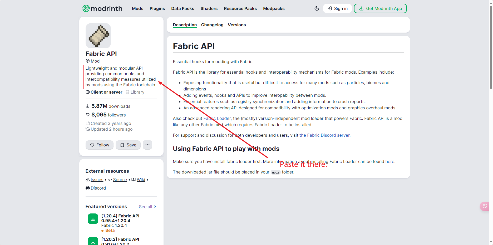

# CMAN —— The Comprehensive Minecraft Archive Network

English  <a href="./README.zh-cn.md">简体中文</a>

## About this

> WARNING: CMAN is a project in development, so if you run into any problems, please start an Issue with us.

CMAN stands for The Comprehensive Minecraft Archive Network. With the increasing complexity of Minecraft mod dependencies, we launched the CMAN project with reference to the experience of the game's Kerbal Space Program community in module management.

CMAN is dedicated to create a mod management mode different from the traditional "download mod manually => copy mod file game folder => check dependency => download dependency mod". To download mods with CMAN, you only need to check the mods you are interested in, click confirm, and CMAN will handle everything from mod download to dependency management.

## Getting Started

Work-in-progress.

## Upload your mod to CMAN

The CMAN-spider program will periodically get the latest mods from Modrinth for use in generating `.mod` files and uploading them to platforms like Github. All you need to do is upload your mods to Modrinth, and within 24 hours, you will be able to search for your mods on CMAN.

> If you do not want CMAN to include your mod, please add "[CMAN]Do not include this mod" to the mod's description.
>
> 

## Join us

If you wish to join the development of CMAN, you should follow these points or your PR will be closed by us.

1. Before adding a feature to CMAN, please talk to the community and make sure we need it!
2. Before launching a PR, make sure you have tested the program for proper functionality.

## Copyright Statement

Although CMAN uses the LGPL v2.1 as a license, you can add CMAN to your program (e.g. Minecraft launcher, etc.) as long as you apply to us via Issue to use CMAN in your program and get permission to do so!
